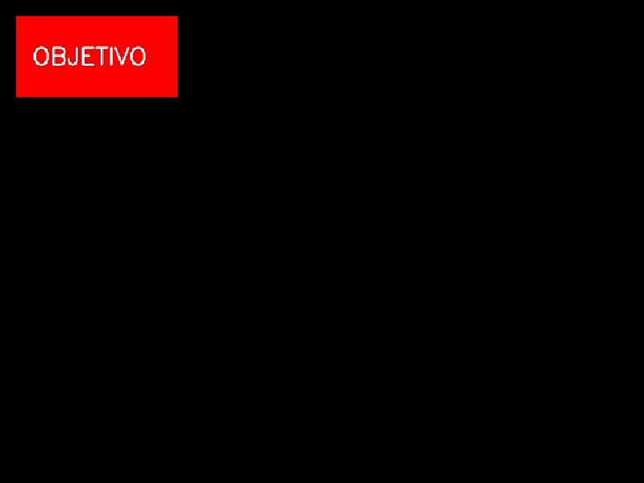
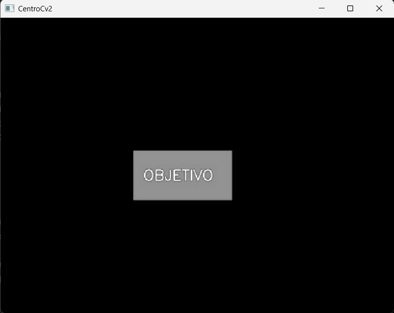
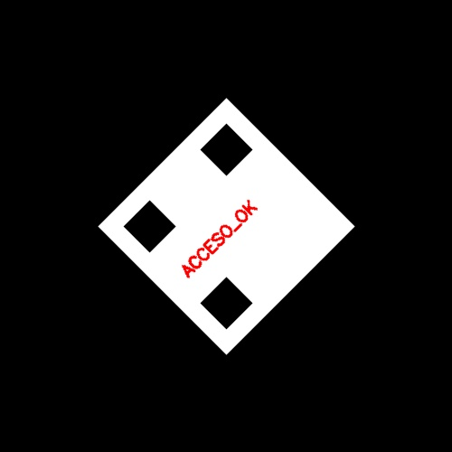
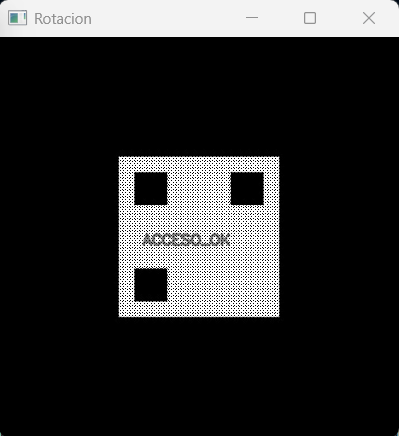
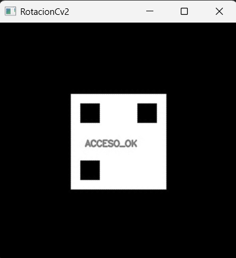
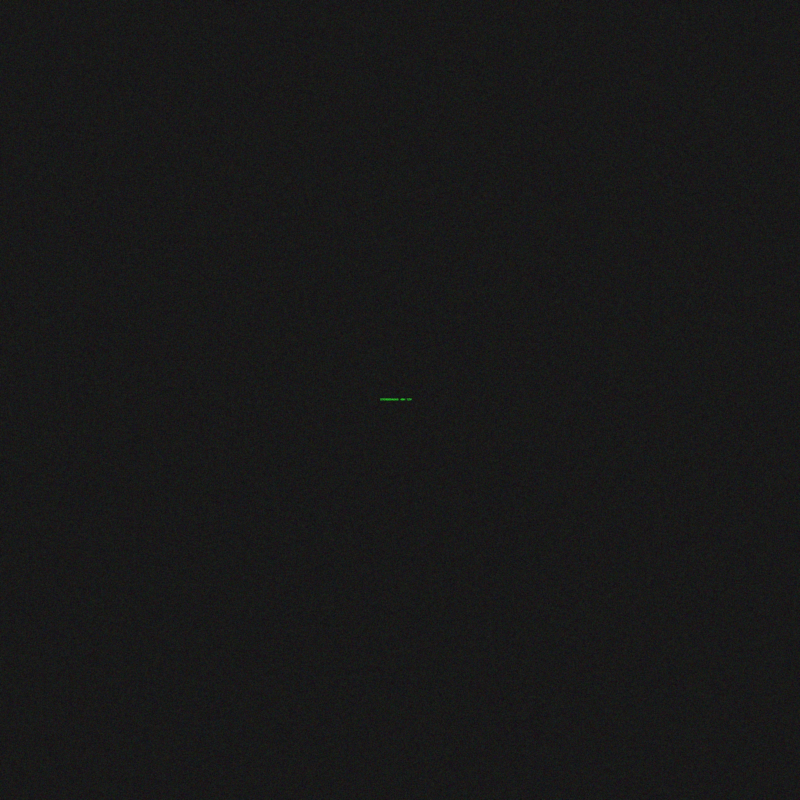

# Graficación
## Practica 2: Trasformaciones Geométicas

### Alumno: Marcelo Vicente Pascual Tapia 
### No. de Control: 24121386
### Grupo: B

### Profesor: Jesús Eduardo Alcaraz Chavez

### Objetivo de la practica: Dominar tanto la matemática pura detrás de las transformaciones como la optimización de OpenCV.

## Misión 1: El Artefacto Desplazado (Traslación)

Nuestros satélites han captado la ubicación de un vehículo sospechoso en una imagen de 800x600 píxeles. Sin embargo, un error en los sensores del satélite desplazó la imagen. El vehículo, que debería estar en el centro exacto, está pegado a la esquina superior izquierda.



1. Modo Raw (Manual): Crea un lienzo negro nuevo de 600x800. Traslada los píxeles de la imagen original al lienzo nuevo utilizando la matemática pura de coordenadas (ya sea con ciclos for o "slicing" de NumPy). ¡Prohibido usar cv2.warpAffine!
2. Modo OpenCV: Construye la matriz de traslación 
 y utiliza la función optimizada cv2.warpAffine para lograr el mismo resultado.

### Resultados




### Código
```
import cv2 as cv
import numpy as np


# Cargar la imagen
img = cv.imread(r"C:\Users\marce\Downloads\Ovni.png", 0)
x, y = img.shape
rows, cols = img.shape


# ==========================================
# MÉTODO 1: MODO RAW (Manipulación de Píxeles)
# ==========================================
# 1. Crea un lienzo negro vacío (np.zeros) de 600x800
# 2. Mueve los píxeles al nuevo lienzo sumando 300 en X y 200 en Y


#Definir el desplazamiento en x e y
dx = 250
dy = 250

#Crear una imagen vacía para la traslación
translated_img = np.zeros((x, y), dtype=np.uint8)

#Trasladar la imagen
for i in range(x):
    for j in range(y):
        new_x = i + dx
        new_y = j + dy
        if 0 <= new_x and 0 <= new_y and new_x<x and new_y<y:
            translated_img[new_x, new_y] = img[i, j]


# ==========================================
# MÉTODO 2: MODO OPENCV (Matriz de Transformación)
# ==========================================
# 1. Crea la matriz de traslación 'M' en NumPy
# 2. Aplica cv2.warpAffine a la imagen original

M = np.float32([[1, 0, 250], [0, 1, 250]])
dst = cv.warpAffine(img, M, (cols, rows))

cv.imshow("Imagen", img)
cv.imshow("Centro", translated_img)
cv.imshow("CentroCv2", dst)
cv.waitKey(0)
cv.destroyAllWindows()
```
#### ¿Notaste alguna diferencia de tiempo al procesar la imagen píxel por píxel con ciclos for (Modo Raw) en comparación con la función cv2.warpAffine de OpenCV? 
Sí, definitivamente hubo una diferencia significativa en el tiempo de ejecución al procesar la imagen píxel por píxel con ciclos for en el Modo Raw en comparación con el uso de la función cv2.warpAffine de OpenCV. 

#### ¿Por qué crees que tu código manual tarda mucho más en ejecutarse?
Cuando se usa ciclos for para recorrer cada píxel de la imagen y calcular las nuevas posiciones de cada píxel, el proceso es muy ineficiente en términos de tiempo de ejecución.
Mientras que cv2.warpAffine (y otras funciones similares de OpenCV) están altamente optimizadas para realizar transformaciones geométricas en imágenes. Estas funciones utilizan algoritmos eficientes a nivel de bajo nivel, generalmente implementados en C o ensamblador, y se benefician de optimizaciones como: paralelización, operaciones vectorizadas y acceso contiguo a la memoria.

## Misión 2: El Código Mareado (Rotación)
Hemos interceptado un código QR que nos dará acceso al servidor de los sospechosos. Para evitar que lo escaneemos, lo han girado de forma extraña. Si intentamos leerlo así, nuestros escáneres fallan. ¡Necesitamos enderezarlo!



1. Modo Raw (Manual): Usa ciclos anidados para recorrer la imagen vacía de destino. Para cada píxel, calcula de qué coordenada de la imagen original proviene aplicando las fórmulas trigonométricas inversas.
2. Modo OpenCV: Usa cv2.getRotationMatrix2D para generar tu matriz de rotación tomando como eje el centro de la imagen (250, 250), y aplícala con cv2.warpAffine.

### Resultados




### Código
```
import cv2 as cv
import numpy as np
import math

# Cargar la imagen
qr = cv.imread(r"C:\Users\marce\Downloads\qr.png", 0)
x , y = qr.shape

# ==========================================
# MÉTODO 1: MODO RAW (Trigonometría)
# ==========================================
# 1. Crea un lienzo vacío de 500x500
# 2. Usa las fórmulas de senos y cosenos para mapear los píxeles (¡Cuidado con los huecos negros si mapeas hacia adelante!)

rotated_img = np.zeros((x, y), dtype=np.uint8)
cx, cy = int(x  // 2), int(y  // 2)
angle = 45
theta = math.radians(angle)

# Rotar la imagen
for i in range(x):
    for j in range(y):
        new_x = int((j - cx) * math.cos(theta) - (i - cy) * math.sin(theta) + cx)
        new_y = int((j - cx) * math.sin(theta) + (i - cy) * math.cos(theta) + cy)  #round((diag//2))
        if 0 <= new_x < x and 0 <= new_y < y:
            rotated_img[new_y, new_x] = qr[i, j]

# ==========================================
# MÉTODO 2: MODO OPENCV
# ==========================================
# 1. Obtén la matriz con cv2.getRotationMatrix2D
# 2. Aplica cv2.warpAffine

center = (y // 2, x // 2)
M = cv.getRotationMatrix2D(center, -45, 1)
dstR = cv.warpAffine(qr, M, (y, x))


cv.imshow("Qr", qr)
cv.imshow("Rotacion", rotated_img)
cv.imshow("RotacionCv2", dstR)
cv.waitKey(0)
cv.destroyAllWindows()
```

#### Al calcular la rotación píxel por píxel con tus fórmulas matemáticas (Modo Raw), ¿te quedaron 'puntos negros' o píxeles sin color esparcidos en la imagen resultante? 
Si a pesar que la imagen original era solida y continua, al trasformarla con el modo Raw ha resultado una imagen discontinua con pixeles sin color esparcidos de forma uniforme, esto debido a que al buscar las nuevas coordenas de la imagen trasformada hay valores que no pueden calcular por tener unicamente que trabajar con números enteros.

#### ¿Cómo te imaginas que algoritmos profesionales como los de OpenCV logran rotar la imagen sin dejar esos huecos vacíos?
Mediante una combinación de transformaciones geométricas inversas e interpolación avanzada, en lugar de simplemente mover píxeles de un lugar a otro.
 
## Misión 3: El Microfilm Oculto (Escalamiento)

Encontramos un archivo de imagen gigantesco de 2000x2000 píxeles. Al inspeccionarlo de cerca, notamos que en el centro hay un texto diminuto. Los criminales encogieron la evidencia.
 


1. Modo Raw (Manual): Recorta una región central de la imagen (por ejemplo, de 200x200 píxeles donde está el texto). Crea un nuevo lienzo de 1000x1000 y usa la matemática para "estirar" los píxeles del recorte. (Pista: te quedará un efecto pixelado tipo "Vecino Más Cercano").
2. Modo OpenCV: Utiliza cv2.resize sobre ese mismo recorte usando los parámetros fx=5 y fy=5. Prueba el parámetro de interpolación cv2.INTER_CUBIC para ver cómo OpenCV suaviza los bordes mágicamente.