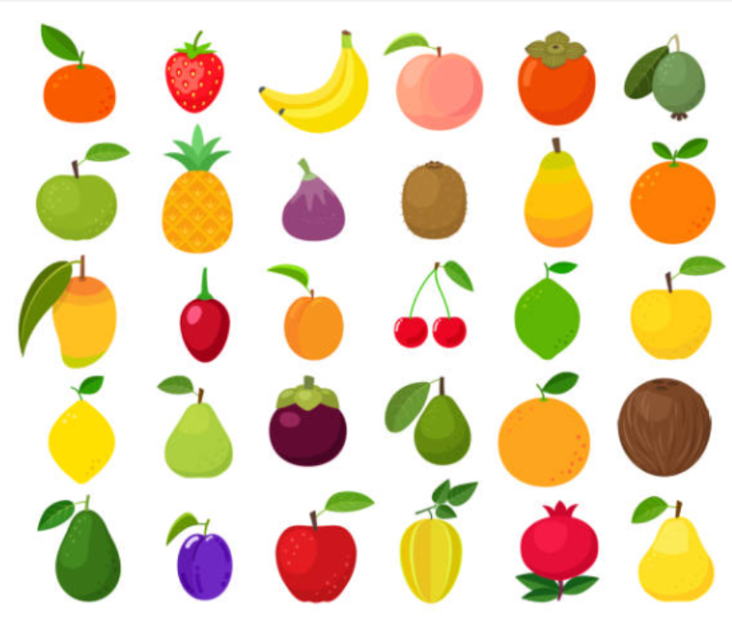
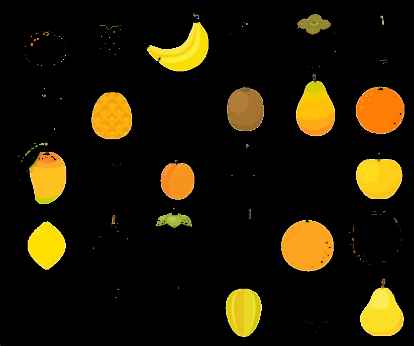
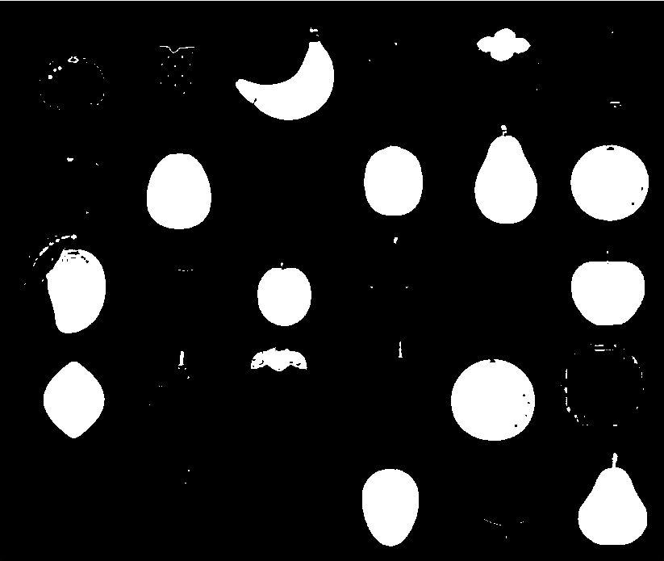

## Actividad 1

### ¿Qué ocurre cuando el rango es muy estrecho?
La gama de colores que selecciona la capa es mas restringida, ocasionando que algunas frutas salgan incompletas debido a que cuenta con mas colores aparte de su color principal.
### ¿Qué ocurre cuando el rango es muy amplio?
Salen las frutas mas completas pero debido a que el rango de la gama de colores de la capa es mas extenso alcanza a abarcar algunos colores extra, lo cual ocasiona que se seleccionen fragmentos de otras frutas de diferente color.
## Actividad 2

