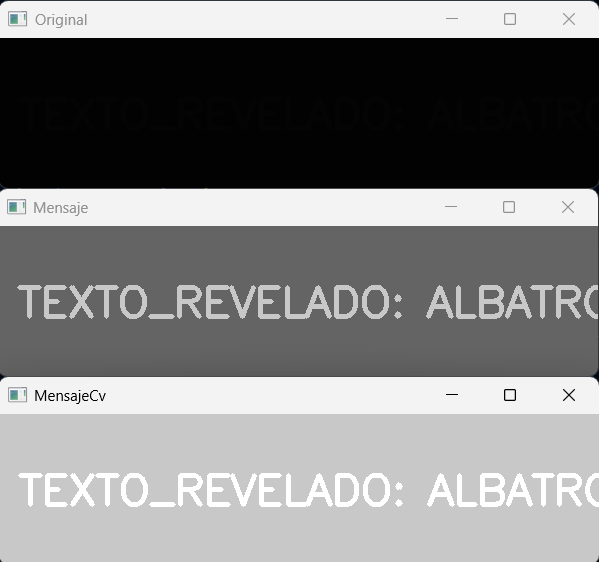
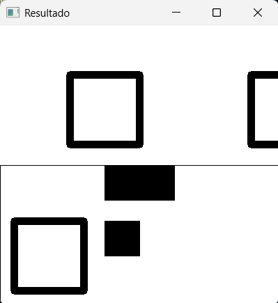
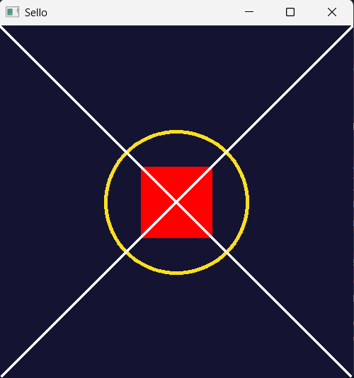
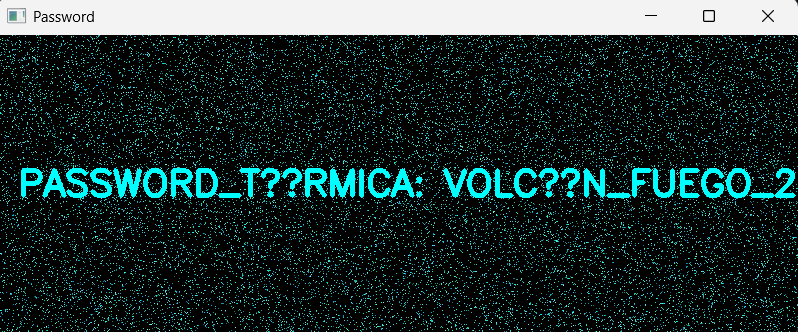
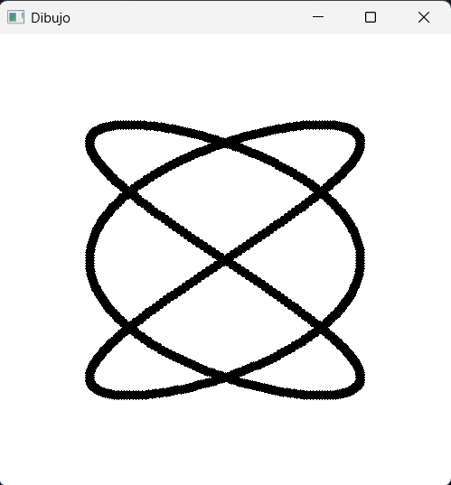

#  Reporte de Misión: Graficación Táctica
**Agente Especial:** [Marcelo Vicente Pascual Tapia/24121386]

---
##  Evidencias de Misión
### Misión 1: El Mensaje Subexpuesto (Operadores Puntuales)
#### Código
```
import cv2 as cv
import numpy as np

img = cv.imread(r"C:\Users\marce\Downloads\m1_oscura.png", 0)
x,y = img.shape

mensaje = np.zeros((x, y), dtype=np.uint8)

for i in range(x):
    for j in range(y):
        if 1<=img[i][j]<=5:
            mensaje[i][j]=img[i][j]*50


mensajeCv = np.zeros((x, y), dtype=np.uint8)
mensajeCv = cv.multiply(img, 100)

cv.imshow("Original", img)
cv.imshow("Mensaje", mensaje)
cv.imshow("MensajeCv", mensajeCv)
cv.waitKey(0)
cv.destroyAllWindows()
```
#### Resultados


#### Conclusión
El método manual en modo raw funciona muy bien pero solo si conozco el rango en que los datos están escondidos además que es mas largo de programar, en cambio el método por OpenCv ademas de ser mucho más corto no necesito conocer el rango en el que están escondidos los datos.

### Misión 2: El QR Fragmentado (Transformaciones Geométricas)
#### Código
```
import cv2 as cv
import numpy as np

mitad1 = cv.imread(r"C:\Users\marce\Downloads\m2_mitad1.png", 0)
mitad2 = cv.imread(r"C:\Users\marce\Downloads\m2_mitad2.png", 0)
rows, cols = mitad2.shape

qr = np.zeros((400,400), dtype=np.uint8)

center = (cols / 2, rows / 2)
M = cv.getRotationMatrix2D(center, 180, 1)
mitad2R = cv.warpAffine(mitad2, M, (cols, rows))

for i in range(400):
    for j in range(400):
        if i<200:
            qr[i][j] = mitad1[i][j]
        else:
            qr[i][j] = mitad2R[i-200][j]

cv.imshow("Resultado", qr)
cv.waitKey(0)
cv.destroyAllWindows()
```
#### Resultados


#### Conclusión
Unir las images fue fácil, pero lo que me ahorro mas trabajo definitivamente fue usar el método cv.warpAffine ya que pudo rotar la imagen de forma perfecta en el centro sin dejar ruido o pixeles negros, además de ser muy corto e intuitivo de programar.

### Misión 3: El Sello Biométrico (Primitivas de Dibujo)
#### Código
```
import cv2 as cv
import numpy as np

sello = np.full((500, 500, 3), (50, 20, 20), dtype=np.uint8)

cv.circle(sello, (250,250), 100, (33,222,255), 3)
cv.rectangle(sello, (200,200), (300,300), (0,0,255), -1)
cv.line(sello, (0,0), (499,499), (255,255,255), 2)
cv.line(sello, (499,0), (0,499), (255,255,255), 2)

cv.imshow("Sello", sello)
cv.waitKey(0)
cv.destroyAllWindows()
```
#### Resultados


#### Conclusión
Es muy practico e intuitivo usar las primitivas de dibujo para imagenes simples.

### Misión 4: La Frecuencia Térmica (Modelo HSV)
#### Código
```
import cv2 as cv
import numpy as np

contrasena = cv.imread(r"C:\Users\marce\Downloads\m4_ruido.png")
hsv = cv.cvtColor(contrasena,cv.COLOR_BGR2HSV)

lower_cian = np.array([80, 100, 100])  
upper_cian = np.array([100, 255, 255])  

masc = cv.inRange(hsv, lower_cian, upper_cian)
result = cv.bitwise_and(contrasena, contrasena, mask=masc)

cv.imshow("Password", result)
cv.waitKey(0)
cv.destroyAllWindows()
```
#### Resultados


#### Conclusión
Al conocer el rango del color en HSV fue prácticamente fácil el filtrar la imagen para obtener lo que necesitabamos. 

### Misión 5: La Antena Parabólica (Ecuaciones Paramétricas)
#### Código
```
import cv2 as cv
import numpy as np

lienzo = np.ones((500, 500, 3), dtype=np.uint8)*255

t_values = np.arange(0, 2 * np.pi, 0.01) 

x_valores = 250 + 150 * np.sin(3 * t_values)
y_valores = 250 + 150 * np.sin(2 * t_values)


for x, y in zip(x_valores, y_valores):
    x = int(x)
    y = int(y)
    cv.circle(lienzo,(x,y), 5, (0,0,0), -1)

cv.imshow("Dibujo", lienzo)
cv.waitKey(0)
cv.destroyAllWindows()
```
#### Resultados

#### Conclusión
Aunque es un poco complicado, dibujar figuras a través de parámetros puede ser una opción muy viable para ilustrar figuras con una gran exactitud a pesar de trabajar con pixeles.

---
##  Análisis del Analista (Reflexiones Finales)

1. **Sobre los Operadores Puntuales (Misión 1):** Matemáticamente, ¿qué pasaría si en lugar de multiplicar por 50, hubieras sumado 50 a cada píxel oscuro? ¿Se revelaría el texto igual de claro o la imagen perdería contraste?
> No creo pues el contraste del color en comparación del fondo seria el mismo que en la imagen original, lo único que cambiaría es que se vería un poco menos oscura.

2. **Sobre el Espacio HSV (Misión 4):** ¿Por qué el modelo de color BGR es ineficiente para la Recuperación de Información cuando buscamos "todos los tonos de azul celeste", y por qué el modelo HSV resuelve este problema con una sola variable?
> Supongo que es porque el modelo HSV cuenta con una escala unicamente para el color en si, ya que los otros son para el brillo y la saturación, mientras que el BGR obtiene el color a partir de sus 3 canales, así que con HSV basta con obtener el rango del color que necesitamos de unicamente un canal que calcularlo en los 3 canales del BGR.

3. **Sobre Ecuaciones Paramétricas (Misión 5):** ¿Por qué las ecuaciones paramétricas (usando el parámetro t) son mejores para dibujar formas cerradas y complejas en graficación por computadora que usar la clásica función $y=f(x)$?
> Porque por la forma clásica solo podemos obtener un valor de $y$ por valor de $x$ sin hacer mas de una función, en cambio con las parametricas podemos graficar figuras que tangan tantos valores de $y$ como de $x$ que necesitemos con una única funsión.


