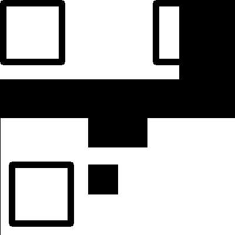
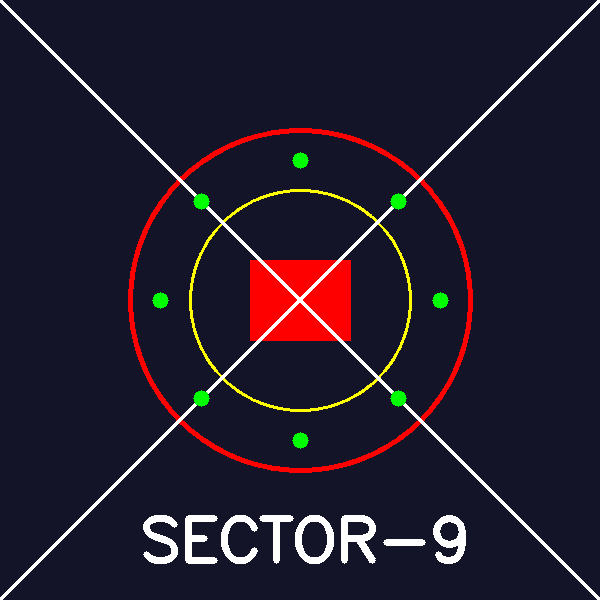
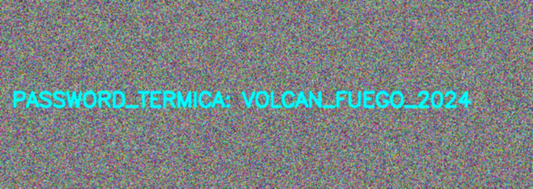
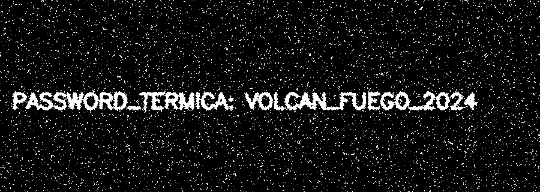
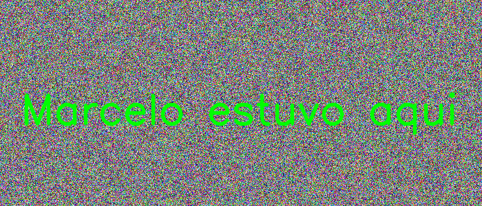
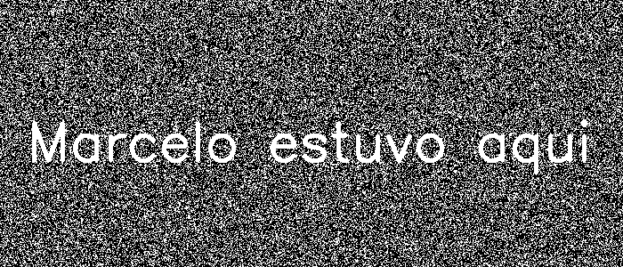

# Reporte de Misión: Graficación Táctica II
**Agente Especial:** [Marcelo Vicente Pascual Tapia/24121386]

---
## Evidencias
### Misión 1
- Imagen recuperada x50: (inserta)

- Imagen recuperada x50 + 20: (inserta)

- Código:
```
import cv2 as cv
import numpy as np

img = cv.imread(r"C:\Users\marce\Downloads\m1_oscura_1.png", 0)
x, y = img.shape

trans_img = np.zeros((x, y), dtype=np.uint8)

for i in range(x):
    for j in range(y):
        trans_img[i][j] = img[i][j]*50


trans_img_cv2 = cv.add(trans_img,20)

cv.imwrite("m1_recuperado_x50.png", trans_img)
cv.imwrite("m1_recuperado_x50_mas20.png", trans_img_cv2)

cv.imshow("m1_oscura", img)
cv.imshow("m1_recuperado_x50", trans_img)
cv.imshow("m1_recuperado_x50_mas20", trans_img_cv2)

cv.waitKey(0)
cv.destroyAllWindows()
```

### Misión 2
- QR reconstruido: (inserta)


- Código:
```
import cv2 as cv
import numpy as np

img2 = cv.imread(r"C:\Users\marce\Downloads\m2_mitad1_1.png", 0)

x, y = img2.shape

coords = np.argwhere(img2 < 255)
fila, col = coords.min(axis=0)

M_inversa = np.float32([[1, 0, -col], [0, 1, -fila]])
img2_or = cv.warpAffine(img2, M_inversa, (y, x))


img3 = cv.imread(r"C:\Users\marce\Downloads\m2_mitad2_1.png",0)
x, y = img3.shape

centro = (y // 2, x // 2)

matriz = cv.getRotationMatrix2D(centro, 180, 1.0)

img3_rotada = cv.warpAffine(img3, matriz, (y, x))

lienzo = np.full((400, 400, 3), 255, dtype=np.uint8)

for i in range(400):
    for j in range(400):
        if(i<200):
            lienzo[i][j] = img2_or[i][j]
        else:
            lienzo[i][j] = img3_rotada[i-200][j]


cv.imwrite("m2_qr_reconstruido.png", lienzo)

cv.imshow("img2", img2)
cv.imshow("img2_or", img2_or)
cv.imshow("img3", img3)
cv.imshow("img3_rotada", img3_rotada)
cv.imshow("m2_qr_reconstruido", lienzo)

cv.waitKey(0)
cv.destroyAllWindows()
```

### Misión 3
- Sello forjado: (inserta)


- Código:
```
import cv2 as cv
import numpy as np
import math

img4 = np.zeros((600, 600, 3), dtype=np.uint8)
img4[:] = (40, 20, 20)

cv.circle(img4, (300,300), 170, (0,0,255), 3)
cv.circle(img4, (300,300), 110, (0,255,255), 2)
cv.rectangle(img4, (250, 260), (350, 340), (0,0,255), -1)
cv.line(img4, (0,0), (599,599), (255,255,255), 2)
cv.line(img4, (0,599), (599,0), (255,255,255), 2)
for i in range(8):
    angle = i * math.pi / 4
    x = int(300 + 140 * math.cos(angle))
    y = int(300 + 140 * math.sin(angle))
    cv.circle(img4, (x, y), 8, (0, 255, 0), -1)

cv.putText(img4, "SECTOR-9", (140, 560), cv.FONT_HERSHEY_SIMPLEX, 2, (255, 255, 255), 5)

cv.imwrite("m3_sello_forjado_v2.png", img4)

cv.imshow("m3_sello_forjado_v2", img4)

cv.waitKey(0)
cv.destroyAllWindows()
```

### Misión 4
- Máscara Cyan: (inserta)
Suavisado:

Máscara:

- Código:
```
import cv2 as cv
import numpy as np

img5 = cv.imread(r"C:\Users\marce\Downloads\m4_ruido_1.png")

kernel = np.ones((3, 3), np.float32) / 9
img_suavizada = cv.filter2D(img5, -1, kernel)

cv.imwrite("m4_suavizada.png", img_suavizada)

img_hsv = cv.cvtColor(img_suavizada, cv.COLOR_BGR2HSV)

lower_cyan = np.array([85, 50, 50])  
upper_cyan = np.array([95, 255, 255])

mask_cyan = cv.inRange(img_hsv, lower_cyan, upper_cyan)

cv.imwrite("m4_mask_cyan.png", mask_cyan)

cv.imshow("Imagen Suavizada", img_suavizada)
cv.imshow("Mascara Cyan", mask_cyan)

cv.waitKey(0)
cv.destroyAllWindows()
```

### Misión 5
- Evidencia tricolor: (inserta)

- Mensaje recuperado: (inserta)

- Código:
```
import cv2 as cv
import numpy as np

height, width = 300, 700
img = np.random.randint(0, 256, (height, width, 3), dtype=np.uint8)

cv.putText(img, "Marcelo estuvo aqui", (30, 180), cv.FONT_HERSHEY_SIMPLEX, 2, (0, 255, 0), 3, cv.LINE_AA) 

cv.imwrite("m5_tricolor.png", img)

b, g, r = cv.split(img)

g_b_diff = cv.absdiff(g, b)

r_g_diff = cv.subtract(r, g)

_, otsu_thresh = cv.threshold(g_b_diff, 0, 255, cv.THRESH_BINARY + cv.THRESH_OTSU)

cv.imwrite("m5_mensaje.png", otsu_thresh)

cv.imshow("Imagen Original", img)
cv.imshow("Mensaje Recuperado", otsu_thresh)

cv.waitKey(0)
cv.destroyAllWindows()
```

---
## Análisis del Analista (Reflexiones Finales)

1. **Operadores puntuales (M1):** ¿Qué diferencia visual hay entre recuperar con multiplicación (x50) y recuperar con suma (+50)? ¿Cuál preserva mejor el contraste del texto?
>(x50) porque de esa forma la diferencia de contraste se hace mas alta y se puede distinguir mejor los donde hay tonos mas claros y oscuros, mientras que con la suma la diferencia de contraste seguira siendo la misma por lo que el contraste seguira siendo minimo.

2. **Transformaciones geométricas (M2):** ¿Por qué es importante escoger el centro correcto al rotar una imagen con `getRotationMatrix2D`?
>Porque si no estuviera en el centro es muy posible que no se muestre la imagen incompleta al rotarla ya que se saldria del rango de la ventana.

3. **Convolución (M4):** ¿Por qué un filtro promedio puede ayudar a reducir falsos positivos antes de segmentar por HSV, y qué desventaja tiene sobre los bordes del texto?

>Porque el filtro promedio actúa suavizando la imagen, lo que reduce el ruido de alta frecuencia, que al eliminarlo antes de segmentar en HSV evitaremos que pequeños píxeles inutiles sean clasificados erróneamente como parte de nuestro objeto de interés reduciendo así los falsos positivos.

>Su desventaja es que desenfoca o difumina la imagen afectando mas que nada a los bordes del texto, provocando una pérdida de nitidez y contornos suaves en lugar de definidos, lo que puede llegar dificultar la segmentación precisa de caracteres pequeños o letras con trazos finos. 

4. **Canales (M5):** ¿Por qué separar canales puede revelar información que en la imagen a color “no se ve” a simple vista?

>Por que al separar una imagen en canales individuales se transforman los datos de color complejo a una representación en escala de grises que resalta características específicas basadas en la intensidad de un color o valor en especifico.