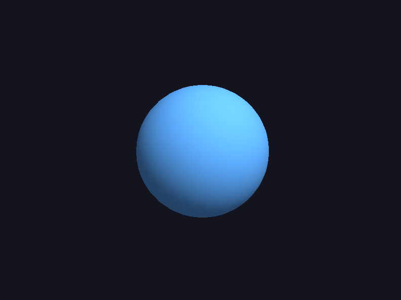
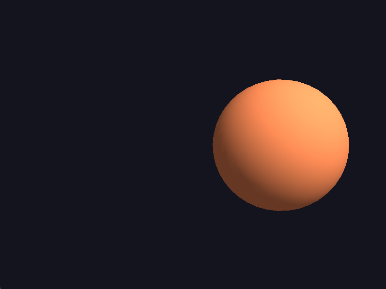
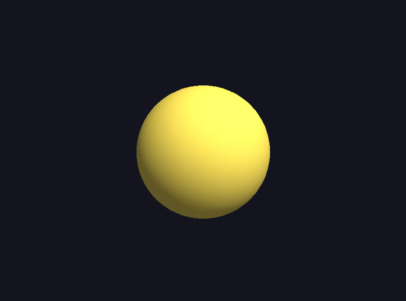

# Reporte de Misión: Órbita Dual (Cámara vs Objeto)
**Agente Especial:** [Marcelo Vicente Pascual Tapia/24121386]

---
## Evidencias
### Misión 1
- Objeto rota:
  
- Cámara orbita:
  
- Código:
```
def render_rotating_object(angle: float) -> None:
    """Modo 1: cámara fija (translate -Z), el objeto rota."""
    glMatrixMode(GL_MODELVIEW)
    glLoadIdentity()
    glTranslatef(0.0, 0.0, -CAM_DISTANCE)
    glRotatef(angle, 0.0, 1.0, 0.0)
    glColor3f(0.35, 0.65, 1.0)
    draw_sphere(1.0)


def render_orbiting_camera(angle: float) -> None:
    """
    Modo 2 (variante del material): primero rotar la vista (-angle en Y),
    luego alejar en -Z. Objeto conceptualmente fijo en origen.
    """
    glMatrixMode(GL_MODELVIEW)
    glLoadIdentity()
    glRotatef(-angle, 0.0, 1.0, 0.0)
    glTranslatef(0.0, 0.0, -CAM_DISTANCE)
    glColor3f(1.0, 0.55, 0.35)
    draw_sphere(1.0)
```

### Misión 2
- LookAt órbita:
  
- Código:
```
def render_with_lookat(angle: float) -> None:
    """Modo 3: cámara en órbita con gluLookAt."""
    glMatrixMode(GL_MODELVIEW)
    glLoadIdentity()
    a = math.radians(angle)
    cam_x = ORBIT_RADIUS * math.sin(a)
    cam_z = ORBIT_RADIUS * math.cos(a)
    gluLookAt(cam_x, 0.0, cam_z, 0.0, 0.0, 0.0, 0.0, 1.0, 0.0)
    glColor3f(0.95, 0.85, 0.35)
    draw_sphere(1.0)
```

### Misión 3 (opcional)
- Notas:
  Ya en todas las caprutas anteriores agrege la ilumminación.

## Codigo completo:
```
#!/usr/bin/env python3
"""
Operación Órbita Dual — ejemplo funcional (GLFW + PyOpenGL, pipeline fijo).
Sin GLUT: la esfera se dibuja con gluSphere (GLU).

Instalación (venv recomendado):
  pip install PyOpenGL PyOpenGL_accelerate glfw

Controles:
  1  Modo: rotar OBJETO (cámara fija)
  2  Modo: orbitar CÁMARA (objeto fijo, variante rotate(-a) + translate)
  3  Modo: gluLookAt (órbita del ojo)
  ESC o Q  Salir

Cambios que debes hacer (alumnos):
  - Misión 1: en render_orbiting_camera_variant_b() prueba el OTRO orden
    (translate + rotate) y compara con capturas.
  - Misión 2: ajusta radio de órbita (5.0) o distancia Z (-5) y documenta.
  - Misión 3: activa USE_LIGHTING = True y mueve glLightfv al sitio indicado.
"""

from __future__ import annotations

import math
import sys

import glfw
from OpenGL.GL import *
from OpenGL.GLU import *

# ---------------------------------------------------------------------------
# Configuración que suelen tocar los alumnos
# ---------------------------------------------------------------------------
WINDOW_TITLE = "Orbita Dual (GLFW) — 1/2/3 cambia modo"
INITIAL_MODE = 1  # 1, 2 o 3
ORBIT_RADIUS = 5.0
CAM_DISTANCE = 5.0  # alejamiento en -Z en modos 1 y 2
ANGLE_SPEED = 0.6  # grados por frame (sube/baja para animar más rápido)

# Misión 3: pon True y completa la colocación de la luz respecto a la cámara/objeto
USE_LIGHTING = True


# ---------------------------------------------------------------------------
# Geometría (GLU, no GLUT)
# ---------------------------------------------------------------------------
_quadric = None


def draw_sphere(radius, slices, stacks):
    """Dibuja una esfera sólida usando GLU (Seguro para Windows)"""
    quadric = gluNewQuadric()
    gluQuadricNormals(quadric, GLU_SMOOTH)
    gluSphere(quadric, radius, slices, stacks)
    gluDeleteQuadric(quadric)


# --------------------------------------------------

def draw_two_spheres():
    """Dibuja las esferas formando el ojo"""
    glPushMatrix()
    
    # Esclerótica (blanco)
    glColor3f(1.0, 1.0, 1.0)
    glPushMatrix()
    glTranslatef(0.56, 0, 0)
    draw_sphere(0.6, 40, 40)
    glPopMatrix()
    
    # Iris (azul grisáceo)
    glColor3f(0.84, 0.85, 0.92)
    glPushMatrix()
    glTranslatef(0.49, 0, 0)
    draw_sphere(0.55, 35, 35)
    glPopMatrix()
    
    # Parte rosada del iris
    glColor3f(0.85, 0.67, 0.65)
    glPushMatrix()
    glTranslatef(0.7, 0, 0)
    draw_sphere(0.54, 35, 35)
    glPopMatrix()

    # Pupila (negro)
    glColor3f(0.0, 0.0, 0.0)
    glPushMatrix()
    glTranslatef(0.3, 0, 0)
    draw_sphere(0.4, 30, 30)
    glPopMatrix()
    
    glPopMatrix()

def draw_sphere(radius: float = 1.0) -> None:
    global _quadric
    if _quadric is None:
        _quadric = gluNewQuadric()
        gluQuadricDrawStyle(_quadric, GLU_FILL)
    gluSphere(_quadric, radius, 40, 24)


def setup_basic_lighting() -> None:
    """Luz simple en coordenadas de vista (0,0,1) — experimenta moviéndola."""
    glEnable(GL_LIGHTING)
    glEnable(GL_LIGHT0)
    glEnable(GL_COLOR_MATERIAL)
    glColorMaterial(GL_FRONT_AND_BACK, GL_AMBIENT_AND_DIFFUSE)

    pos = [0.5, 0.8, 1.0, 0.0]  # direccional si w=0
    amb = [0.2, 0.2, 0.2, 1.0]
    dif = [0.9, 0.9, 0.85, 1.0]
    glLightfv(GL_LIGHT0, GL_POSITION, pos)
    glLightfv(GL_LIGHT0, GL_AMBIENT, amb)
    glLightfv(GL_LIGHT0, GL_DIFFUSE, dif)


# ---------------------------------------------------------------------------
# Tres modos de cámara / objeto
# ---------------------------------------------------------------------------
def render_rotating_object(angle: float) -> None:
    """Modo 1: cámara fija (translate -Z), el objeto rota."""
    glMatrixMode(GL_MODELVIEW)
    glLoadIdentity()
    glTranslatef(0.0, 0.0, -CAM_DISTANCE)
    glRotatef(angle, 0.0, 1.0, 0.0)
    glColor3f(0.35, 0.65, 1.0)
    draw_sphere(1.0)


def render_orbiting_camera(angle: float) -> None:
    """
    Modo 2 (variante del material): primero rotar la vista (-angle en Y),
    luego alejar en -Z. Objeto conceptualmente fijo en origen.
    """
    glMatrixMode(GL_MODELVIEW)
    glLoadIdentity()
    glRotatef(-angle, 0.0, 1.0, 0.0)
    glTranslatef(0.0, 0.0, -CAM_DISTANCE)
    glColor3f(1.0, 0.55, 0.35)
    draw_sphere(1.0)


def render_orbiting_camera_variant_b(angle: float) -> None:
    """
    Variante alternativa (como en el diagrama del .org): translate primero, rotate después.
    Descomenta en main() y compara con render_orbiting_camera().
    """
    glMatrixMode(GL_MODELVIEW)
    glLoadIdentity()
    glTranslatef(0.0, 0.0, -CAM_DISTANCE)
    glRotatef(angle, 0.0, 1.0, 0.0)
    glColor3f(0.45, 1.0, 0.45)
    draw_sphere(1.0)


def render_with_lookat(angle: float) -> None:
    """Modo 3: cámara en órbita con gluLookAt."""
    glMatrixMode(GL_MODELVIEW)
    glLoadIdentity()
    a = math.radians(angle)
    cam_x = ORBIT_RADIUS * math.sin(a)
    cam_z = ORBIT_RADIUS * math.cos(a)
    gluLookAt(cam_x, 0.0, cam_z, 0.0, 0.0, 0.0, 0.0, 1.0, 0.0)
    glColor3f(0.95, 0.85, 0.35)
    draw_sphere(1.0)
    


def main() -> None:
    if not glfw.init():
        print("Error: no se pudo inicializar GLFW", file=sys.stderr)
        sys.exit(1)

    # OpenGL 2.1 = pipeline fijo usable en Linux/Windows (mac puede exigir perfil distinto)
    glfw.window_hint(glfw.CONTEXT_VERSION_MAJOR, 2)
    glfw.window_hint(glfw.CONTEXT_VERSION_MINOR, 1)

    window = glfw.create_window(800, 600, WINDOW_TITLE, None, None)
    if not window:
        glfw.terminate()
        print("Error: no se pudo crear la ventana OpenGL", file=sys.stderr)
        sys.exit(1)

    glfw.make_context_current(window)
    glfw.swap_interval(1)

    mode = INITIAL_MODE

    def on_key(win, key, scancode, action, mods):
        nonlocal mode
        if action != glfw.PRESS:
            return
        if key in (glfw.KEY_ESCAPE, glfw.KEY_Q):
            glfw.set_window_should_close(win, True)
        elif key == glfw.KEY_1:
            mode = 1
        elif key == glfw.KEY_2:
            mode = 2
        elif key == glfw.KEY_3:
            mode = 3
        elif key == glfw.KEY_4:
            mode = 4

    glfw.set_key_callback(window, on_key)

    glEnable(GL_DEPTH_TEST)
    glClearColor(0.08, 0.08, 0.12, 1.0)

    if USE_LIGHTING:
        setup_basic_lighting()

    angle = 0.0

    while not glfw.window_should_close(window):
        fb_w, fb_h = glfw.get_framebuffer_size(window)
        if fb_h <= 0:
            fb_h = 1
        glViewport(0, 0, fb_w, fb_h)
        glClear(GL_COLOR_BUFFER_BIT | GL_DEPTH_BUFFER_BIT)

        glMatrixMode(GL_PROJECTION)
        glLoadIdentity()
        gluPerspective(50.0, fb_w / float(fb_h), 0.1, 100.0)

        if not USE_LIGHTING:
            glDisable(GL_LIGHTING)

        if mode == 1:
            render_rotating_object(angle)
        elif mode == 2:
            render_orbiting_camera(angle)
        elif mode ==3:
            render_orbiting_camera_variant_b(angle)
        else:
            render_with_lookat(angle)

        angle += ANGLE_SPEED
        if angle >= 360.0:
            angle -= 360.0

        glfw.swap_buffers(window)
        glfw.poll_events()

    glfw.terminate()


if __name__ == "__main__":
    main()
```

---
## Análisis del Analista (Reflexiones Finales)

1. **Orden de matrices:** ¿Por qué en OpenGL fijo el orden en que escribes =glTranslatef= / =glRotatef= cambia el resultado aunque uses los mismos números?
> Porque las transformaciones en OpenGL clásico se acumulan en la matriz actual y se aplican en orden inverso al que se escriben. Por eso no es lo mismo trasladar y luego rotar que rotar y luego trasladar.

2. **Objeto vs cámara:** En la práctica, ¿cuándo prefieres rotar el modelo y cuándo orbitar la cámara?
> Prefiero rotar el modelo cuando quiero mostrar el objeto desde varios ángulos, como en una vista de inspección, presentación de un modelo 3D o animación del objeto. En cambio, prefiero orbitar la cámara cuando el objeto debe permanecer fijo en el mundo y lo que quiero cambiar es el punto de vista del observador, como en un visor 3D, videojuego o simulador.

3. **gluLookAt vs translate+rotate:** ¿Qué ventaja tiene describir la cámara con ojo–objetivo–arriba para equipos de desarrollo?
> La ventaja es que gluLookAt permite describir la cámara de forma más clara y entendible: se indica dónde está el ojo, hacia dónde mira y cuál es la dirección superior. Esto facilita que otros integrantes del equipo entiendan la intención de la cámara sin tener que interpretar una cadena de rotaciones y traslaciones. Además, ayuda a separar la lógica de cámara de la lógica del objeto.

4. **Luces:** Si la luz se define en el frame de la cámara sin reubicarla al mundo, ¿qué artefacto visual esperas al rotar solo el objeto?
> Se espera que la iluminación parezca “pegada” a la cámara en lugar de estar fija en el mundo. Al rotar solo el objeto, las sombras y brillos pueden verse extraños o inconsistentes, porque la luz no está siguiendo una posición física del escenario, sino una referencia dependiente de la vista. Por eso puede parecer que las sombras “mienten” o que el contraste cambia de forma poco natural.